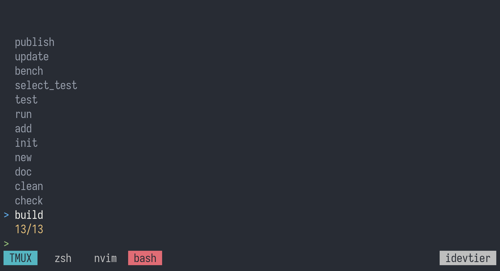

# Tmux plugin for cargo

## Why
Most editors have an option to run cargo commands,
but in my opinion this goes beyond the editor's domain area,
so I decided to write a universal solution for any terminal that has tmux.

## Features
* Run mostly all cargo commands
* Run custom cargo commands
* Fuzzy search of concreate test

## Dependencies
* [Fzf](https://github.com/junegunn/fzf)
* [Cargo](https://github.com/rust-lang/cargo)

## Screenshots


## Install
### Add with [tpm](https://github.com/tmux-plugins/tpm)
```bash
set -g @plugin 'idevtier/tmux-cargo'
```

### Manual install
Clone repo:
```bash
git clone https://github.com/idevtier/tmux-cargo ~/.tmux-cargo
```

Add to `~/.tmux.conf`:
```bash
run-shell ~/.tmux-cargo/tmux-cargo.tmux
```

Reload tmux configuration:
```bash
tmux source-file ~/.tmux.conf
```

## How to use
* Use `prefix+a`
* Tmux will create new window and run `fzf` for cargo commands
* Choose one of them and go
* After running `test` command automatically enters `copy mode`

## In work
* Multiple test selection
* Bench selection
